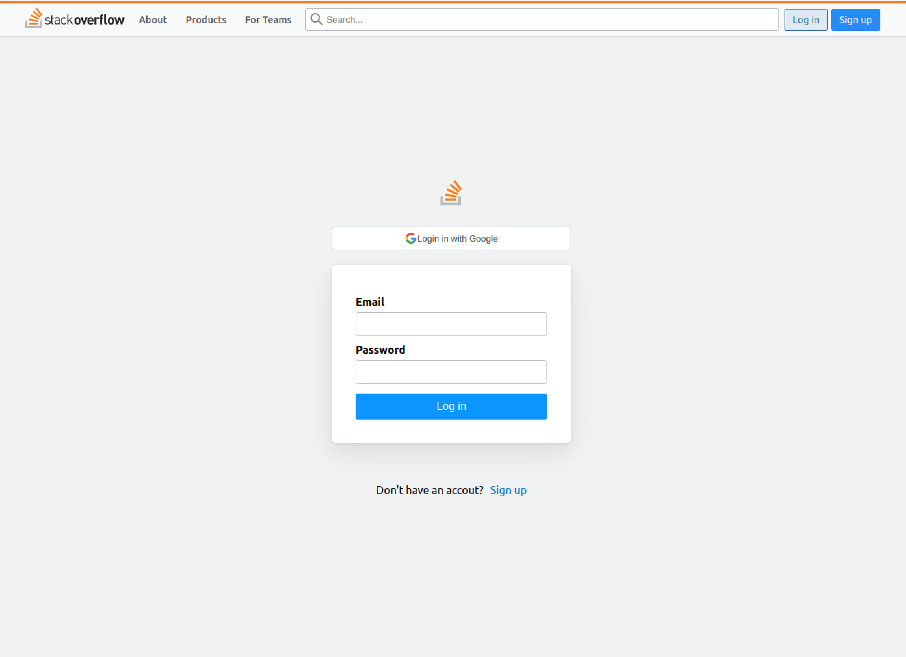

# 🖥️ seb41_pre_040

## Intro
------------
스택 오버플로우 Clone Pre-project 기간: 2022.12.20~2023.01.02

------------

## 👪 팀원 소개

------------

| 이름  | 소속       | 깃헙                          |
|-----|----------|-----------------------------|
| 기수진 | FrontEnd | https://github.com/KISOOJIN |
| 김혜민 | FrontEnd | https://github.com/aemaaeng |
| 이승현 | FrontEnd | https://github.com/KISOOJIN |
| 김성수 | BackEnd  | https://github.com/KISOOJIN |
| 이연희 | BackEnd | https://github.com/yeonini |
| 이재학 | BackEnd | https://github.com/jaehak24 |
| 임준오 | BackEnd | https://github.com/dlawnsdh |

## 📄 소개 노션 페이지
____________
https://www.notion.so/codestates/cd0490aebc3d4709b11056d5e5e03c01

## 🔎 Demo
____________

| 회원가입                             | 로그인     |
|----------------------------------|---------|
| 기수진  https://github.com/KISOOJIN |
| 김혜민  https://github.com/aemaaeng |
| 이승현  https://github.com/KISOOJIN |
| 김성수                              | BackEnd | https://github.com/KISOOJIN |
| 이연희                              | BackEnd | https://github.com/yeonini |
| 이재학                              | BackEnd | https://github.com/jaehak24 |
| 임준오                              | BackEnd | https://github.com/dlawnsdh |

Collaborative: Discord, Github, zoom

> Client 폴더 구조

