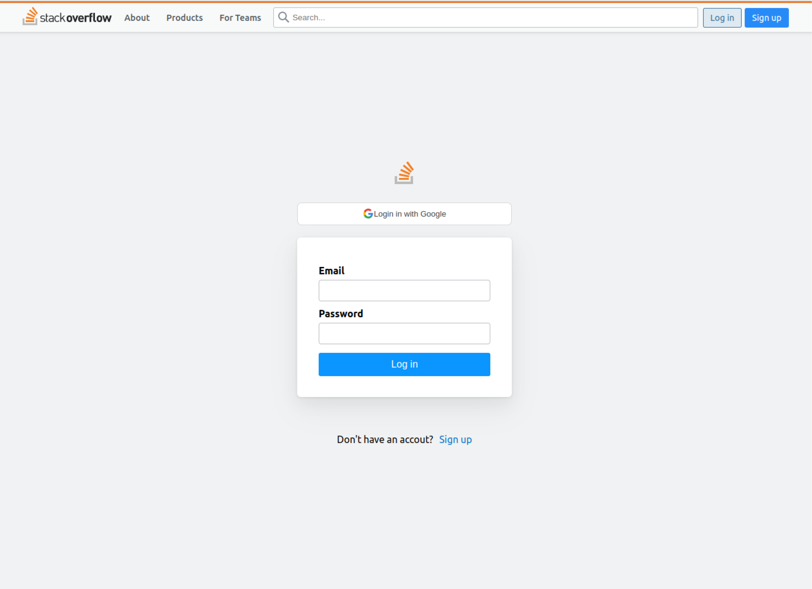
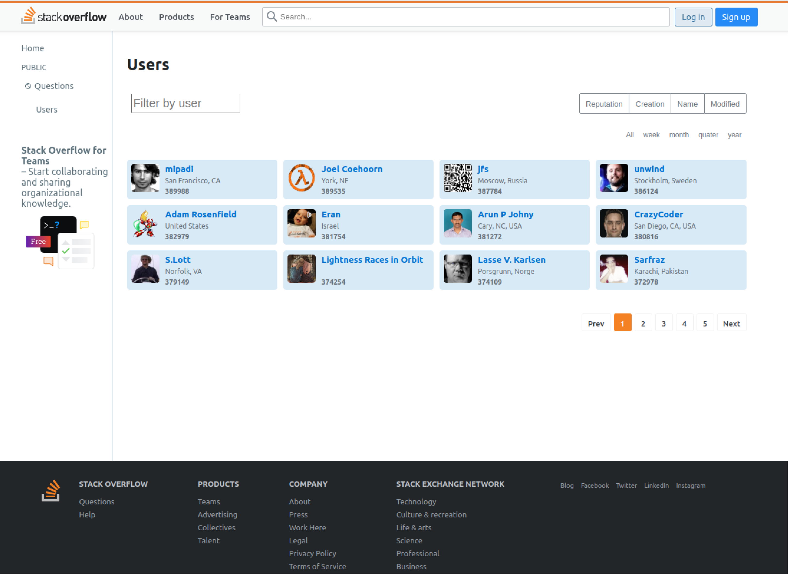
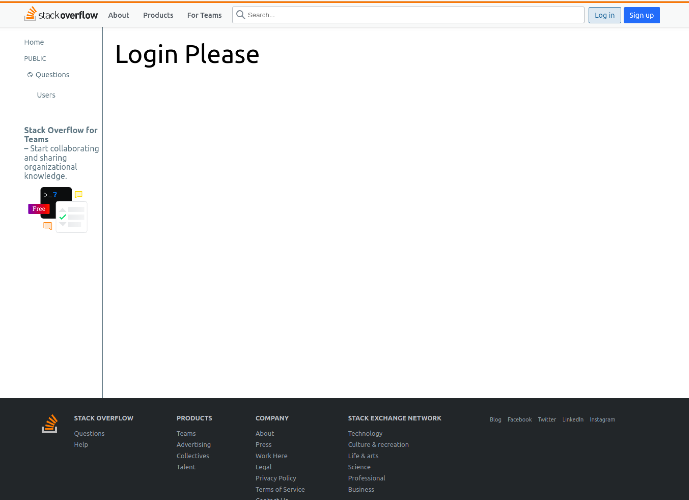
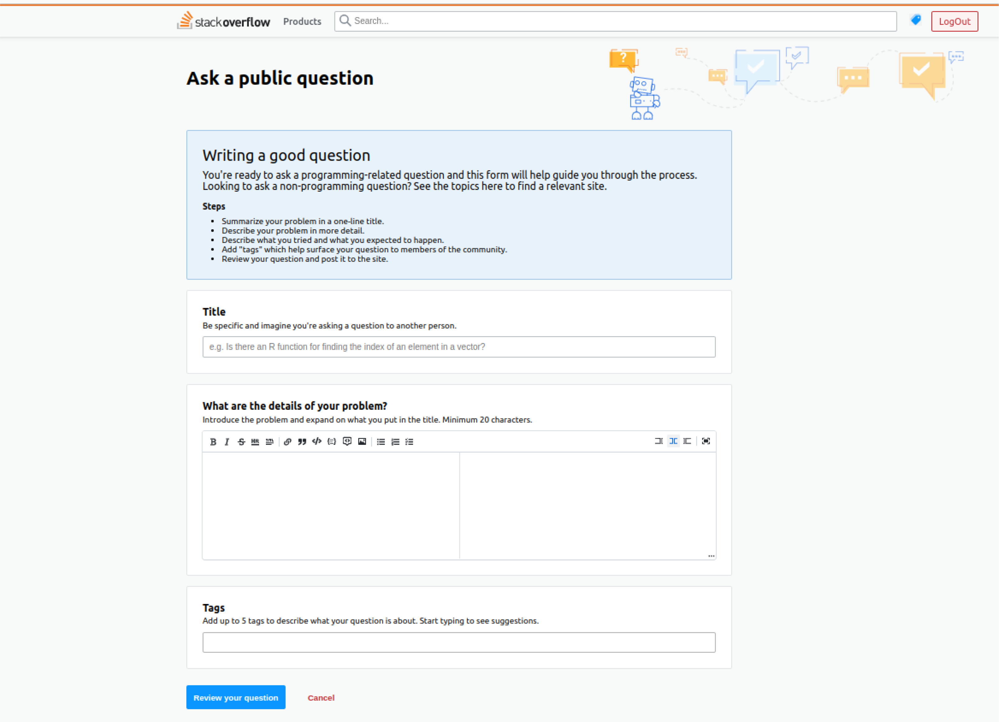

# 🖥️ seb41_pre_040

## 📄Intro
------------
스택 오버플로우 Clone Pre-project 기간: 2022.12.20~2023.01.02

------------

## 👪 팀원 소개

------------

| 이름  | 소속       | 깃헙                          |
|-----|----------|-----------------------------|
| 기수진 | FrontEnd | https://github.com/KISOOJIN |
| 김혜민 | FrontEnd | https://github.com/aemaaeng |
| 이승현 | FrontEnd | https://github.com/KISOOJIN |
| 김성수 | BackEnd  | https://github.com/KISOOJIN |
| 이연희 | BackEnd | https://github.com/yeonini |
| 이재학 | BackEnd | https://github.com/jaehak24 |
| 임준오 | BackEnd | https://github.com/dlawnsdh |

## 📄 소개 노션 페이지
____________
https://www.notion.so/codestates/cd0490aebc3d4709b11056d5e5e03c01

## 🔎 Demo
____________

|         로그인 페이지         |        회원가입 페이지         |
|:-----------------------:|:-----------------------:|
|  |  |
|       마이페이지(로그인)        |        유저 목록 페이지        |
|  |  |
|       마이페이지(비로그인)       |        질문 작성 페이지        | 
|  |  | 
|        질문 상세 페이지        |    질문, 답변, 태크 수정 페이지    | 
|                      |                  | 

## 💪Skills
____________
>Front-End

>Back-End

> Client 폴더 구조

> 서버 폴더 구조